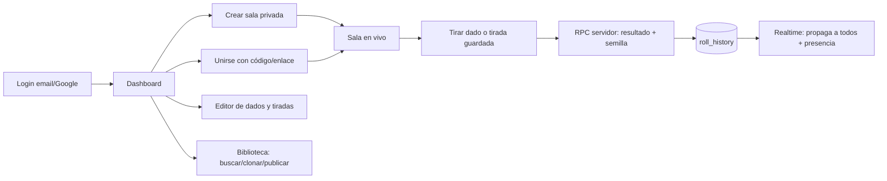

# Fase 0 — Arquitectura

## 1. Stack elegido y justificación

| Capa | Tecnología | Por qué |
|---|---|---|
| Frontend + API | **Next.js 14 (App Router, TypeScript)** | Estándar, mantenible, SSR + Server Actions para validación en servidor. |
| Base de datos | **Supabase (Postgres)** | Relacional (encaja con salas/miembros/roles), RLS para seguridad por rol y sala. |
| Auth | **Supabase Auth** | Email/contraseña + OAuth Google gratis, integrado con RLS. |
| Tiempo real | **Supabase Realtime** | Broadcast de tiradas por canal de sala + Presence (jugadores conectados) sin servidor propio de websockets. |
| Hosting | **Vercel (Hobby)** | Deploy gratis con git push, integración nativa con Next.js. |

**Límites del plan free relevantes:**

- Supabase Free: 500 MB de base de datos, 200 conexiones realtime concurrentes, 50.000 usuarios activos/mes, **el proyecto se pausa tras 7 días sin actividad** (se reactiva desde el dashboard).
- Vercel Hobby: 100 GB de ancho de banda/mes, funciones serverless con timeout de 10 s. Solo uso no comercial.
- OAuth Google: gratuito (requiere crear credenciales en Google Cloud Console).

## 2. Modelo de datos

Esquema SQL completo en `supabase/migrations/0000_schema.sql`.

```
profiles ──< dice            (dados personalizados del usuario)
profiles ──< saved_rolls     (tiradas compuestas guardadas)
profiles ──< rooms           (host_id)
rooms ──< room_members >── profiles   (rol host/player, muted, banned)
rooms ──< room_dice >── dice          (dados habilitados en la sala)
rooms ──< roll_history                (tiradas con autor, desglose, semilla, timestamp)
profiles ──< library_items            (configuraciones públicas: dados + tiradas)
```

Decisiones clave:

- **Roles globales**: `user` | `admin` en `profiles.role`. El rol *anfitrión* es implícito: cualquier usuario registrado crea salas y es `host` en `room_members`.
- **Caras de dado** en JSONB: `[{"value": 6}, {"symbol": "exito"}, ...]`. Símbolos de catálogo fijo: `exito, fallo, critico, blanco, escudo, espada`.
- **Tirada compuesta** en JSONB: `{"parts": [{"die_id": "...", "count": 2}], "modifier": 3}`.
- **Aleatoriedad verificable**: las tiradas se ejecutan en el servidor (RPC de Postgres con `pgcrypto`); se registra la semilla en `roll_history.seed`. Nadie tira "en el cliente".
- **Biblioteca**: `library_items.content` empaqueta dados + tiradas; clonar copia el contenido a las tablas del usuario con `cloned_from`. Estados: `pending → approved → featured` (moderación admin).

## 3. Flujo principal



## 4. Estructura de carpetas

```
desarrollo/
├── docs/                        # Documentación por fase
├── supabase/
│   └── migrations/              # SQL versionado
├── src/
│   ├── app/                     # Rutas (App Router)
│   │   ├── (auth)/login, register
│   │   ├── dashboard/
│   │   ├── salas/[id]/          # Sala en vivo
│   │   ├── dados/               # Editor de dados y tiradas
│   │   ├── biblioteca/
│   │   └── admin/
│   ├── components/
│   ├── lib/
│   │   ├── supabase/            # Clientes browser/server
│   │   └── dice/                # Motor de tiradas (tipos, parser, agregado de símbolos)
│   └── types/
├── .env.local.example
└── README.md
```

## 5. Roadmap

- **Fase 1 — MVP base**: auth + roles, salas privadas con código de invitación, tiradas numéricas vía RPC, historial persistido.
- **Fase 2 — Tiempo real**: broadcast de tiradas, presencia, historial de sesión compartido.
- **Fase 3 — Dados/tiradas avanzados**: editor de caras (números + símbolos), tiradas compuestas, conteo de símbolos.
- **Fase 4 — Biblioteca**: publicar, buscar por juego/etiquetas, clonar, moderación.
- **Fase 5 — Admin y pulido**: panel de gestión, seguridad reforzada, responsive final, guía de despliegue.
